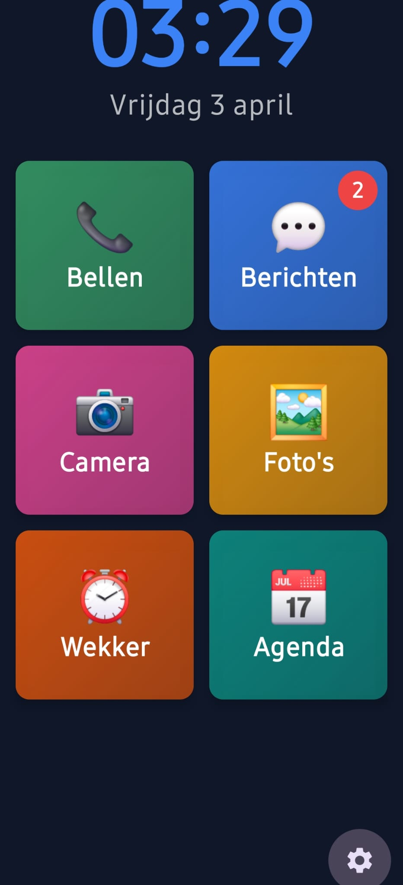
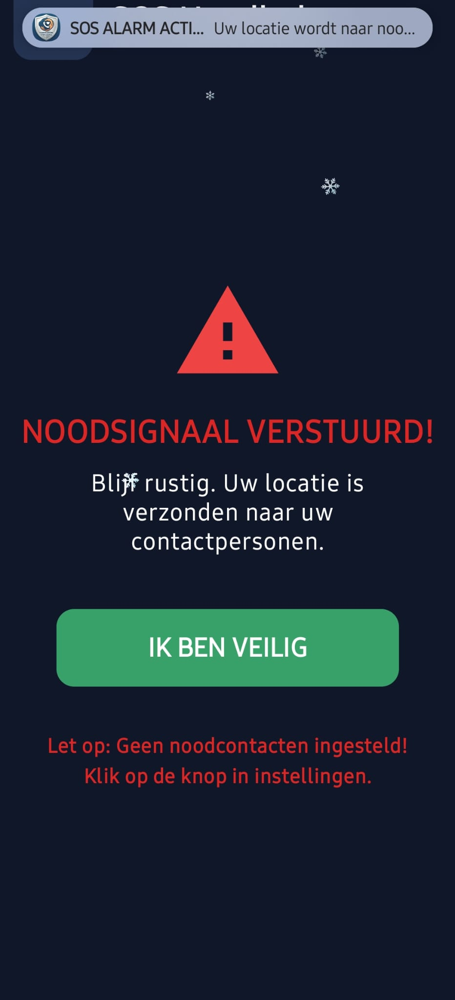
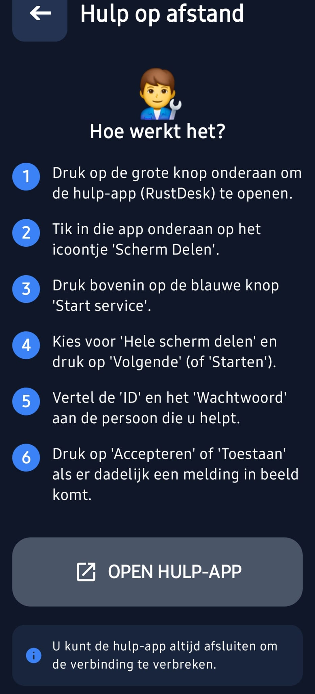
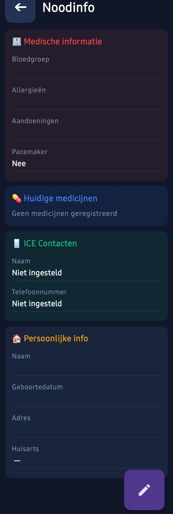

# 📱 Senior Launcher (Beta)

**The honest, open-source Android launcher for our elders. Created to make technology accessible and safe again.**

---

## 📸 Screenshots

  
  
  

  
  
  

  

---

[Nederlandse versie hier](README_NL.md)

---

## Why Senior Launcher?

Many existing launchers for seniors are unnecessarily expensive, full of ads, or secretly collect data. I believe our parents and grandparents deserve better.

This is a **passion project I work on in my spare time**, with the goal of building a launcher that is:

- **Truly Simple** — Large buttons, clear text, and no redundant menus.
- **Privacy First** — Your data stays on your phone. Zero analytics, zero ads.
- **100% Free & Open Source** — Available to everyone without a profit motive.

> **Note:** This project is currently in **Beta phase**. Since I do this alongside my daily work, development can sometimes be a bit slow, but I work on it with a lot of love. **My goal is to eventually publish this app on F-Droid.**

---

## ☕ Support my work

Senior Launcher is a project I offer completely for free. Your support helps enormously to cover costs (such as hosting or testing equipment) and motivates me to keep building new features in my free evenings and weekends.

**Do you think this is a great initiative?** Any contribution, no matter how small, is greatly appreciated!

---

## ✨ Features in detail

### 📞 Calling & Contacts
Large number keys and a list of favorites with photos. One press of a button to call family or friends directly.

### 🆘 SOS Emergency Button
By pressing the SOS button for 3 seconds, emergency contacts are immediately informed via SMS with the exact GPS location.

### 👨‍🔧 Remote Support (RustDesk)
Unique feature that allows a family member to watch remotely to help with settings. Includes a clear step-by-step plan for the senior.

### 🔍 Magnifier & Flashlight
Turn the phone into a digital magnifying glass to easily read small texts on medication or menus.

### 🚶 Step Counter
Stimulates movement by displaying today's step count large and clearly.

### 📅 Calendar & Notes
A simplified calendar and a place for short notes, so you never forget an appointment or errand again.

---

## 🛠️ Development Status

Because we want to be transparent about what does and doesn't work in this beta:

- **🛡️ Fall Detection**: Currently **experimental**. Sensitivity is still being tested to prevent false alarms.
- **🪫 Battery Warning**: This feature is currently **under development** and not yet functional.
- **🌍 Languages**: The base is Dutch, other languages will follow as soon as I find time.

---

## 🎨 Customization & Security

The launcher can be adjusted to the user's needs:
- **Layouts**: Choose from 2x3, 3x4, or 1x1 grid.
- **Font Size**: Everything can be displayed extra large.
- **🔒 Lock Settings**: Secure settings with a PIN code.
  - **Default PIN code**: `1234`

---

## 🏗️ Technology

I use modern and secure technologies to provide the best experience:

| Component | Technology |
|-----------|-------------|
| **Language** | Kotlin 2.0 |
| **UI** | Jetpack Compose + Material 3 |
| **Architecture** | MVVM + Clean Architecture |
| **Database** | Room (SQLite) + DataStore |
| **Background** | WorkManager |
| **Camera** | CameraX (for the Magnifier) |
| **Sensors** | Accelerometer (Fall Detection) & Step Counter |
| **Media** | Media3 ExoPlayer (for the Radio) |
| **Min SDK** | API 26 (Android 8.0) |
| **Target SDK** | API 36 (Android 15) |

---

## 🤝 Contributing

Want to help improve the project? Great! See [CONTRIBUTING.md](CONTRIBUTING.md) for guidelines on reporting bugs or submitting code.

## 🔒 Privacy

Privacy is not an afterthought; it is the core of this project. We **do not collect data**. Everything remains on the senior's phone. Read our full [PRIVACY.md](PRIVACY.md).

## 📜 License

This project is licensed under the **GNU General Public License v3.0**. This means the software will always remain open and free.

---

*"Technology should connect people, not exclude them."* ❤️
