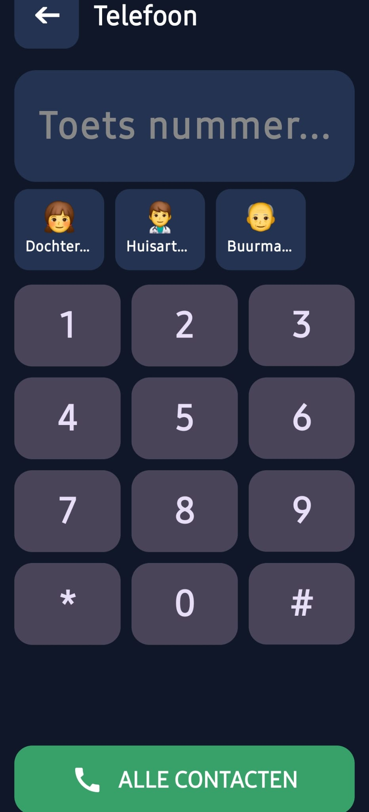
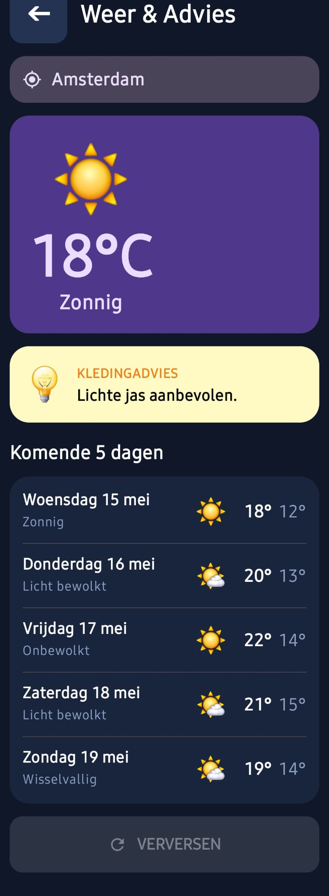
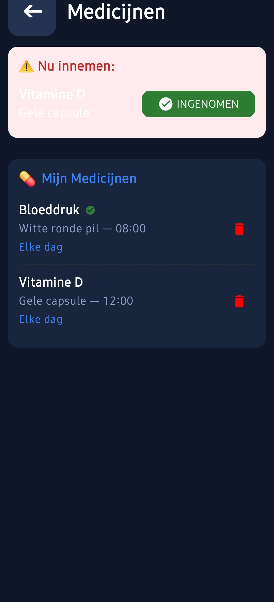

# 📱 Senioren Launcher (0.8.3 Bèta)

**De eerlijke, open-source Android launcher voor onze ouderen. Gemaakt om technologie weer toegankelijk, veilig en menselijk te maken.**

> **⚠️ Bèta Fase:** Dit project wordt in mijn vrije tijd gebouwd. Het is momenteel in bèta, wat betekent dat feedback en hulp bij het testen zeer welkom zijn!

---

## 🛡️ Veiligheid & Privacy (EU & Android 16 Ready)
Dit project is bijgewerkt om te voldoen aan de nieuwste Europese veiligheidsnormen (**AVG/GDPR**) en is volledig geoptimaliseerd voor **Android 16 (Baklava)**:
- **Privacy by Design:** Duidelijke privacy-uitleg bij gevoelige gegevens zoals contacten en locatie.
- **Veilige Updates:** App-updates worden uitsluitend via versleutelde HTTPS-verbindingen gedownload.
- **Modern Schermgebruik:** Volledige ondersteuning voor "Edge-to-Edge" weergave conform Android 15/16 eisen.
- **100% Lokaal:** Uw gegevens verlaten nooit het toestel. Geen cloud, geen tracking, geen advertenties.

---

## 📸 Screenshots

  
  
  

  
  
  

---

## 🌟 Onze Visie: "Senioren-Eerst"
De meeste smartphones zijn ontworpen voor jonge mensen. Wij draaien dat om:
- **Geen Toetsenborden:** Alles werkt met grote Plus/Min knoppen en simpele lijsten.
- **Gigantische Elementen:** Teksten zijn minimaal 20-30sp. Knoppen zijn minstens 70dp hoog.
- **Contrast & Duidelijkheid:** Geen vage icoontjes, maar harde teksten zoals "OPHANGEN" of "OPSLAAN".
- **Digitale Rust:** Geen onnodige notificaties of ingewikkelde veeg-bewegingen.

## ☕ Steun mijn werk
Senioren Launcher is een project dat ik volledig gratis aanbied. Jouw steun helpt enorm om de kosten te dekken (zoals voor hosting of testapparatuur) en motiveert mij om in mijn vrije avonden en weekenden door te blijven bouwen aan nieuwe functies.

**Vind je dit een mooi initiatief?** Elke bijdrage, hoe klein ook, wordt ontzettend gewaardeerd!

---

## ✨ Belangrijkste Functies
- **📞 Bellen:** Grote dialer met favorieten (foto's) en een beveiligde 112-knop.
- **💬 Berichten:** Extra grote SMS-weergave met directe tekst-zoom functie.
- **🆘 SOS:** Houd de knop 3 seconden vast voor noodoproepen en een SMS met uw GPS-locatie.
- **💊 Medicijnen:** Herinneringen met foto's van uw eigen pillen en voorraadbeheer.
- **🎮 Remote Support:** Beheer de telefoon volledig via eenvoudige SMS-codes (geen internet nodig).

---

## 🏗️ Technologie
- **Kotlin 2.1 & Jetpack Compose**
- **Android 16 SDK 36 Klaar**
- **Material 3 Design**

*"Technologie moet mensen verbinden, niet uitsluiten."* ❤️
