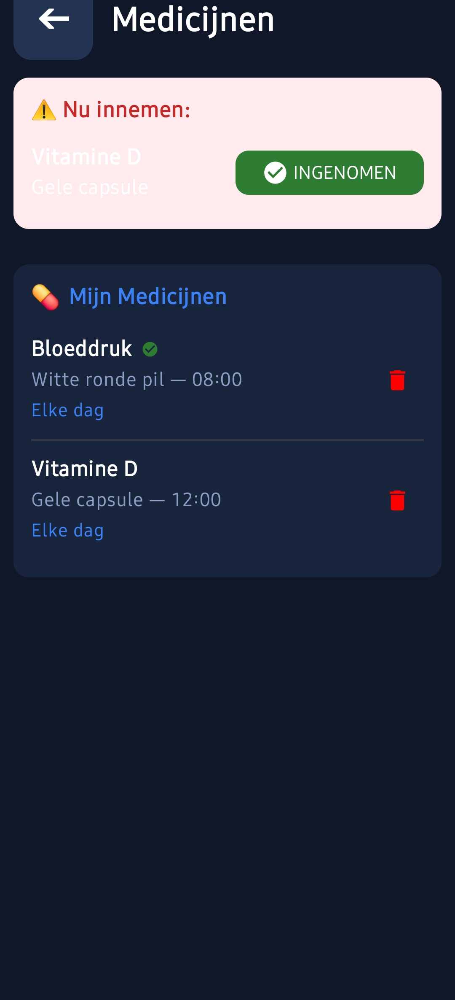

# 📱 Senioren Launcher (0.8.7)

**De eerlijke, open-source Android launcher voor onze ouderen. Gemaakt om technologie weer toegankelijk, veilig en menselijk te maken.**

> **⚠️ Bèta Fase:** Dit project wordt in mijn vrije tijd ontwikkeld om onze (groot)ouders hun digitale vrijheid terug te geven. Het is momenteel in bèta, dus feedback en hulp bij het testen zijn zeer welkom.

---

## 🟢 Wat is nieuw — Recente updates (v0.8.6 → v0.8.7)
Een korte samenvatting van de belangrijkste wijzigingen sinds v0.8.5 — gebaseerd op recente commits en release-voorbereidingen.

- v0.8.7 (2026-05-17)
  - Permissiecontroles toegevoegd aan de FallDetection dialoog en laatste release-fijnslijningen afgerond.
- v0.8.6 (2026-05-17)
  - SOS-flow gestabiliseerd, security-excepties opgelost en batterijgebruik van achtergrondservices geoptimaliseerd.

Andere recente verbeteringen:
- Wi‑Fi snelknop: een Wi‑Fi-knop op het startscherm die het systeem Wi‑Fi-paneel opent.
- Permanente start-acties: Maak Instellingen, Wi‑Fi en Bluetooth permanent zichtbaar op het startscherm en verbeter het Bluetooth-icoon.
- Setup Wizard refactor: caregiver- en senior-flow gescheiden en de setup-ervaring vernieuwd (Android 16 gereed).
- Remote Support: volledige Remote Support-suite met uitgebreide SMS-commando's en documentatie — beheer telefoons via SMS-codes (geen internet nodig).
- Release-automatisering: automatische release-notes generatie en GitHub-releaseflow met APK-attach mogelijkheid.
- UI & toegankelijkheid: globale Radio MiniPlayer met marquee-tekst, HomeScreen layout verbeteringen en schaling voor grote letters gefixt.
- Diverse bugfixes & CI-verbeteringen: vergrootglas-navigatie, PhoneScreen fixes, bijgewerkte screenshots in READMEs en ontbrekende Gradle wrapper-bestanden voor CI toegevoegd.

---

## 🛡️ Veiligheid & Privacy (EU & Android 16 Ready)
Dit project is bijgewerkt om te voldoen aan de nieuwste Europese veiligheidsnormen (**AVG/GDPR**) en is volledig geoptimaliseerd voor **Android 16 (Baklava)**:
- **Privacy by Design:** Duidelijke privacylabels voor gevoelige gegevens (Contacten, GPS).
- **Veilige updates:** App-updates via versleutelde HTTPS-verbindingen.
- **Modern Schermgebruik:** Volledige Edge-to-Edge ondersteuning voor Android 15/16.
- **100% Lokaal:** Uw gegevens verlaten het toestel nooit. Geen cloud, geen tracking.

---

## 🇬🇧 English version
Zie de **[README.md](README.md)** voor de Engelstalige hoofdreadme.

---

## 📸 Screenshots

  
  
  

  
  
  

---

## 🌟 Onze Visie: "Senioren-Eerst"
De meeste smartphones zijn ontworpen voor jonge mensen. Wij draaien dat om. Senioren Launcher is gebouwd volgens strikte UX-regels voor ouderen:
- **Geen toetsenborden:** Alles werkt met grote Plus/Min knoppen en simpele lijsten.
- **Gigantische elementen:** Teksten minimaal 20–30sp. Knoppen minstens 70dp hoog.
- **Digitale rust:** Geen onnodige notificaties of ingewikkelde veeg-bewegingen.

## ❤️ Waardering & Toekomst
Senioren Launcher blijft gratis en open-source. Ik bouw dit naast mijn dagelijkse werk omdat ik geloof dat digitale vrijheid voor ouderen een recht is, geen luxe.

**Wil je meehelpen om dit project duurzaam te houden?**
- **Feedback:** Test de app en stuur je bevindingen.
- **Steun:** Een kleine bijdrage helpt serverkosten te dekken en nieuwe testtoestellen aan te schaffen.

---

## ✨ Belangrijkste Functies
- **📞 Bellen:** Grote dialer met favorieten (foto's) en beveiligde 112-knop.
- **💬 Berichten:** Extra grote SMS-weergave met directe tekst-zoom.
- **🆘 SOS:** Houd 3 seconden vast voor noodoproepen en een SMS met GPS-locatie.
- **💊 Medicijnen:** Herinneringen met foto's van pillen en voorraadbeheer.
- **🎮 Remote Support:** Beheer de telefoon via eenvoudige SMS-codes (geen internet).

---

## 🏗️ Technologie
- **Kotlin 2.1 & Jetpack Compose**
- **Android 16 SDK 36 Klaar**
- **Material 3 Design**

*"Technologie moet mensen verbinden, niet uitsluiten."* ❤️
