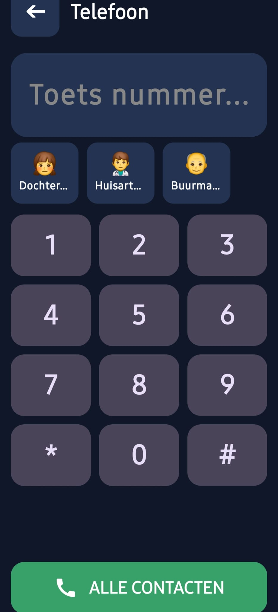
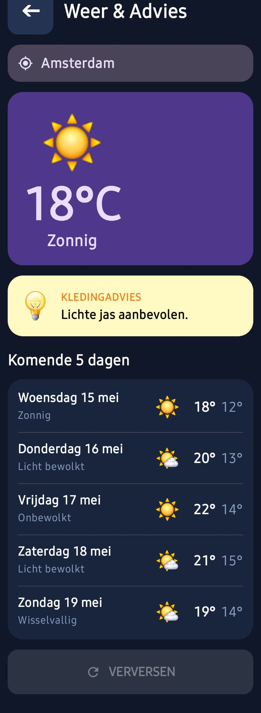

# 📱 Senioren Launcher 🛡️

**De eerlijke, open-source Android launcher voor onze ouderen. Gemaakt om technologie weer toegankelijk, veilig en menselijk te maken.**

100% Gratis & Open Source – Geen trackers, geen cloud, gewoon digitale vrijheid.

---

## 🔗 Het Ecosysteem: Hoe het werkt
De **Senioren Launcher** is onderdeel van een ecosysteem van twee apps die samenwerken voor maximale veiligheid en rust.

1.  **Senioren Launcher** (deze app): Wordt geïnstalleerd op de **telefoon van de senior**. Het biedt een veilige interface en voert commando's op afstand uit.
2.  **[Senioren Beheerder](https://github.com/cma58/SeniorenBeheerder)**: Wordt geïnstalleerd op de **telefoon van de mantelzorger**. Hiermee kunt u op afstand de status, locatie en instellingen beheren.

---

## 🌟 Senioren-Eerst Design
De meeste smartphones zijn ontworpen voor jonge mensen. Wij draaien dat om. De Senioren Launcher is gebouwd volgens strikte UX-regels voor ouderen:
- **Geen Toetsenborden:** Alles werkt met grote knoppen en simpele lijsten.
- **Gigantische Elementen:** Teksten met hoog contrast (20-30sp) en extra grote knoppen (70dp+).
- **Digitale Rust:** Geen onnodige notificaties of ingewikkelde veeg-bewegingen.

## ✨ Belangrijkste Functies
| Functie | Beschrijving |
| :--- | :--- |
| **📞 Simpel Bellen** | Grote dialer met favorieten (foto's) en een beveiligde 112-bevestiging. |
| **💬 Berichten Center** | Extra grote SMS-weergave met directe optie om tekst te vergroten. |
| **🆘 Slimme SOS** | Houd 3 seconden vast voor noodoproepen en automatische GPS-locatie via SMS. |
| **💊 Medicijnbeheer** | Herinneringen met pillenfoto's en automatisch voorraadbeheer. |
| **🎮 Remote Support** | Laat mantelzorgers instellingen beheren via de [Senioren Beheerder](https://github.com/cma58/SeniorenBeheerder) app. |

## 🛡️ Veiligheid & Privacy (Android 17 Klaar)
Volledig geoptimaliseerd voor de nieuwste Android standaarden en AVG/GDPR compliant:
- **Privacy by Design:** Duidelijke afhandeling van machtigingen voor Contacten en GPS.
- **100% Lokaal:** Uw gegevens verlaten het toestel nooit. Geen tracking of data-mining.
- **Modern Schermgebruik:** Volledige Edge-to-Edge ondersteuning voor de nieuwste Android-toestellen.

## 📸 Screenshots

  
  
  

---

## 🇬🇧 English Version
Zie de **[README.md](README.md)** voor de Engelstalige versie.

## ❤️ Waardering & Toekomst
Senioren Launcher is en blijft gratis en open-source. Digitale vrijheid voor ouderen is een recht, geen luxe.

Vindt u dit project waardevol? Overweeg dan een kleine donatie om de verdere ontwikkeling en testtoestellen te ondersteunen.

---
*Gemaakt met zorg om generaties te verbinden en mantelzorgers rust te geven.*
